### Задание

1. Используя команду cat в терминале операционной системы Linux, создать два файла "Домашние животные"
   (заполнив файл "собаками", "кошками", "хомяками") и "Вьючные животные" (заполнив файл "лошадьми", "верблюдами" и "
   ослами"),
   а затем объединить их. Просмотреть содержимое созданного файла. Переименовать файл, дав ему новое имя "Друзья
   человека".
2. Создать директорию, переместить файл туда.
3. Подключить дополнительный репозиторий MySQL. Установить любой пакет из этого репозитория.
4. Установить и удалить deb-пакет с помощью dpkg.
5. Выложить историю команд в терминале Ubuntu.
6. Нарисовать диаграмму, в которой есть классы - родительский, домашние животные и вьючные животные,
   в составы которых в случае домашних животных войдут классы: собаки, кошки, хомяки, а в класс вьючные животные войдут:
   лошади, верблюды и ослы.
7. В подключенном MySQL репозитории создать базу данных “Друзья человека”.
8. Создать таблицы с иерархией из диаграммы в БД.
9. Заполнить низкоуровневые таблицы именами (животных), командами которые они выполняют и датами рождения.
10. Удалить из таблицы верблюдов, т.к. верблюдов решили перевезти в другой питомник на зимовку.
    Объединить таблицы "лошади", и "ослы" в одну таблицу.
11. Создать новую таблицу "молодые животные" в которую попадут все животные старше 1 года, но младше 3 лет
    и в отдельном столбце, с точностью до месяца, подсчитать возраст животных в новой таблице.
12. Объединить все таблицы в одну, при этом сохраняя поля, указывающие на прошлую принадлежность к старым таблицам.
13. Создать класс с Инкапсуляцией методов и наследованием по диаграмме.
14. Написать программу, имитирующую работу реестра домашних животных.
    В программе должен быть реализован следующий функционал:

    14.1. Завести новое животное;

    14.2. Определять животное в правильный класс;

    14.3. Увидеть список команд, которое выполняет животное;

    14.4. Обучить животное новым командам;

    14.5. Реализовать навигацию по меню.

15. Создайте класс Счетчик, у которого есть метод add(), увеличивающий̆ значение внутренней̆ int переменной̆ на 1
    при нажатии “Завести новое животное”. Сделайте так, чтобы с объектом такого типа можно было работать в блоке
    try-with-resources.
    Нужно бросить исключение, если работа с объектом типа счетчик была не в ресурсном try и/или ресурс остался открыт.
    Значение считать в ресурсе try, если при заведения животного заполнены все поля.

### Решение
1. Используя команду cat в терминале операционной системы Linux, создать
два файла Домашние животные (заполнив файл собаками, кошками,
хомяками) и Вьючные животными заполнив файл Лошадьми, верблюдами и
ослы), а затем объединить их. Просмотреть содержимое созданного файла.
Переименовать файл, дав ему новое имя (Друзья человека).
 
mkdir "итоговая"
cd итоговая
cat > "домашние животные"
Собаки
Кошки
Хомяки
cat > "вьючные животные"
Лошади
Верблюды
Ослы
cat "домашние животные" "вьючные животные" > "животные"
cat животные
Собаки
Кошки
Хомяки
Лошади
Верблюды
Ослы
mv "животные" "друзья человека"
ls
'вьючные животные'  'домашние животные'  'друзья человека'
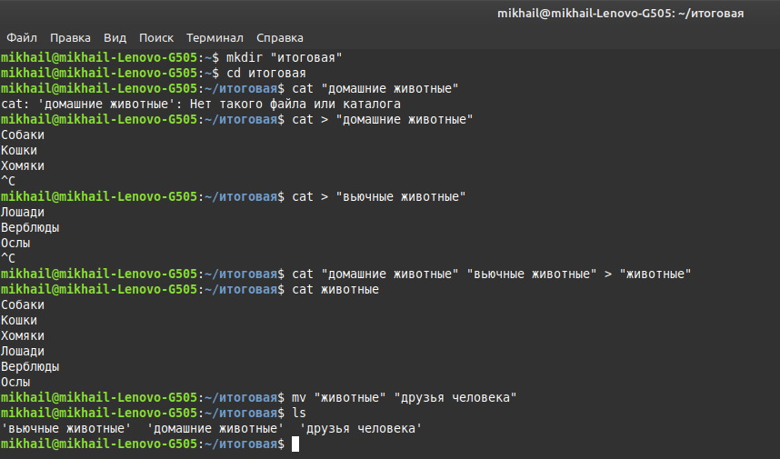
2. Создать директорию, переместить файл туда.

mkdir "директория"
ls
'вьючные животные'   директория  'домашние животные'  'друзья человека'
mv "друзья человека" директория/
cd директория
ls
'друзья человека'
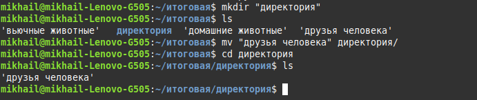
3. Подключить дополнительный репозиторий MySQL. Установить любой пакет
из этого репозитория.

sudo apt update
sudo apt install mysql-server
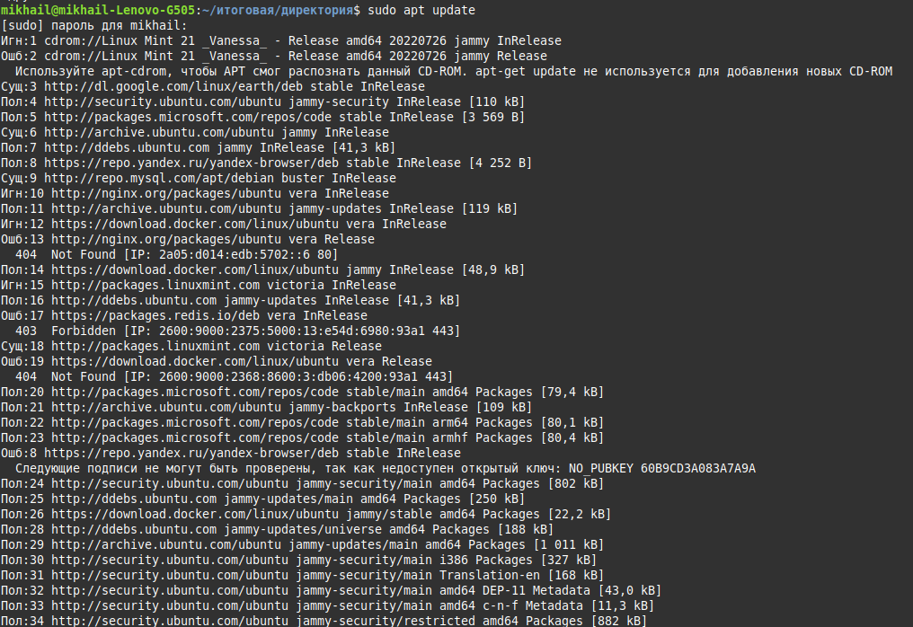

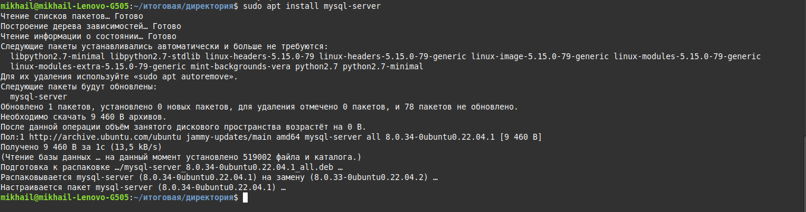

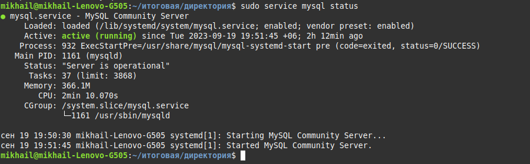

4. Установить и удалить deb-пакет с помощью dpkg.

wget http://ftp.us.debian.org/debian/pool/main/s/sl/sl_5.02-1_amd64.deb
sudo dpkg -i sl_5.02-1_amd64.deb
sudo dpkg -r sl
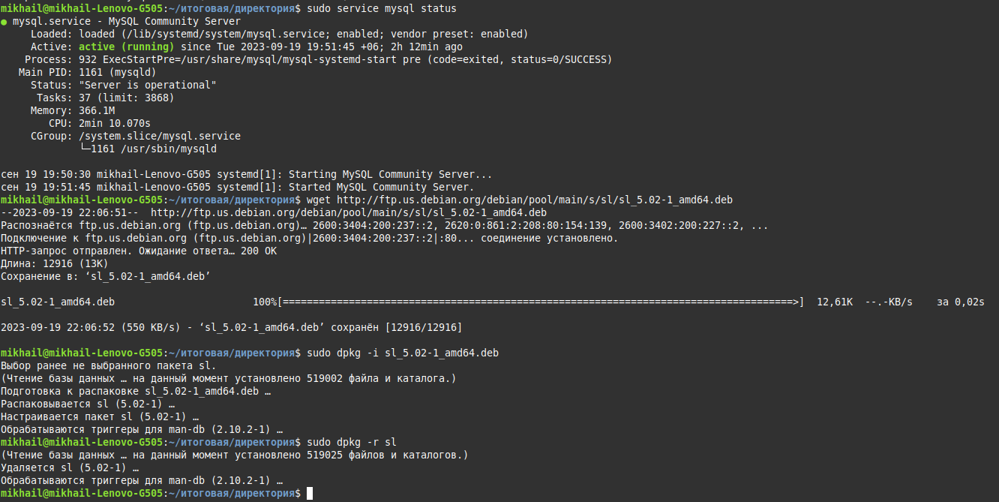

5. Выложить историю команд в терминале ubuntu

1038  mkdir "итоговая"
 1039  cd итоговая
 1040  cat "домашние животные"
 1041  cat > "домашние животные"
 1042  cat > "вьючные животные"
 1043  cat "домашние животные" "вьючные животные" > "животные"
 1044  cat животные
 1045  mv "животные" "друзья человека"
 1046  ls
 1047  mkdir "директория"
 1048  ls
 1049  mv "друзья человека" директория/
 1050  cd директория
 1051  ls
 1052  sudo apt update
 1053  sudo apt install mysql:8.1.0
 1054  sudo apt install mysql8.1.0
 1055  sudo apt install mysql-server
 1056  sudo service mysql status
 1057  wget http://ftp.us.debian.org/debian/pool/main/s/sl/sl_5.02-1_amd64.deb
 1058  sudo dpkg -i sl_5.02-1_amd64.deb
 1059  sudo dpkg -r sl
 1060  history

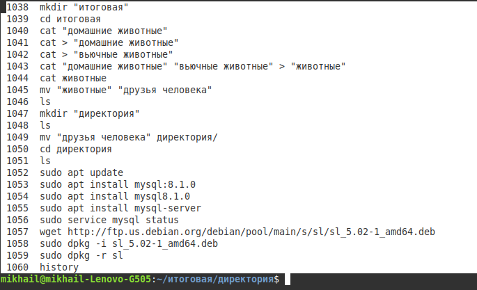

6. Нарисовать диаграмму, в которой есть класс родительский класс, домашние
животные и вьючные животные, в составы которых в случае домашних
животных войдут классы: собаки, кошки, хомяки, а в класс вьючные животные
войдут: Лошади, верблюды и ослы).

pictures for project

7. В подключенном MySQL репозитории создать базу данных “Друзья
человека”

docker pull mysql/mysql-server:latest
docker run --name=mysql01 -d mysql/mysql-server:latest
docker logs mysql01
docker exec -it mysql01 mysql -uroot -p
mysql> CREATE DATABASE Friend_man;
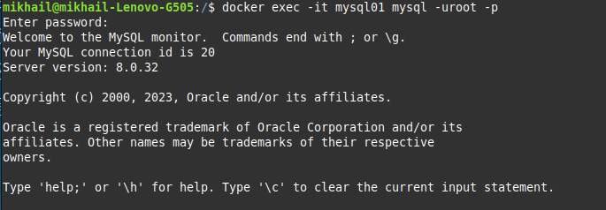

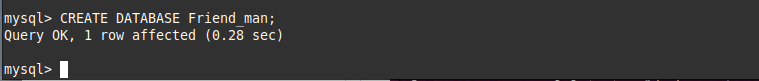

8. Создать таблицы с иерархией из диаграммы в БД

mysql> CREATE TABLE animal (id INT NOT NULL AUTO_INCREMENT, type Varchar(20) NOT NULL, PRIMARY KEY(id));

mysql> CREATE TABLE Domestic_animals (id INT NOT NULL AUTO_INCREMENT, class VARCHAR(50) NOT NULL, id_animal INT, PRIMARY KEY (id));
mysql> CREATE INDEX animals_domestic ON Domestic_animals (id_animal);

mysql> CREATE TABLE Dogs (id INT NOT NULL AUTO_INCREMENT, name VARCHAR(50) NOT NULL, decree VARCHAR(200), birthdate Date NOT NULL, `id_home` INT, PRIMARY KEY (id));
mysql> CREATE INDEX home_dogs ON Dogs (id_home);

mysql> CREATE TABLE Cats (id INT NOT NULL AUTO_INCREMENT, name VARCHAR(50) NOT NULL, decree VARCHAR(200), birthdate Date NOT NULL, `id_home` INT, PRIMARY KEY (id));
mysql> CREATE INDEX home_cats ON Cats (id_home);

mysql> CREATE TABLE Hamsters (id INT NOT NULL AUTO_INCREMENT, name VARCHAR(50) NOT NULL, decree VARCHAR(200), birthdate Date NOT NULL, `id_home` INT, PRIMARY KEY (id));
mysql> CREATE INDEX home_hamsters ON Hamsters (id_home);

mysql> CREATE TABLE Pack_animals (id INT NOT NULL AUTO_INCREMENT, class VARCHAR(50) NOT NULL, id_animal INT, PRIMARY KEY (id));
mysql> CREATE INDEX animals_pack ON Pack_animals (id_animal);

mysql> CREATE TABLE Horses (id INT NOT NULL AUTO_INCREMENT, name VARCHAR(50) NOT NULL, decree VARCHAR(200), birthdate Date NOT NULL, `id_pack` INT, PRIMARY KEY (id));
mysql> CREATE INDEX pack_horses ON Horses(id_pack);

mysql> CREATE TABLE Camels (id INT NOT NULL AUTO_INCREMENT, name VARCHAR(50) NOT NULL, decree VARCHAR(200), birthdate Date NOT NULL, `id_pack` INT, PRIMARY KEY (id));
mysql> CREATE INDEX pack_camels ON Camels(id_pack);

mysql> CREATE TABLE Donkeys (id INT NOT NULL AUTO_INCREMENT, name VARCHAR(50) NOT NULL, decree VARCHAR(200), birthdate Date NOT NULL, `id_pack` INT, PRIMARY KEY (id));
mysql> CREATE INDEX pack_donkeys ON Donkeys(id_pack);

mysql> show databases;
mysql> show tables;
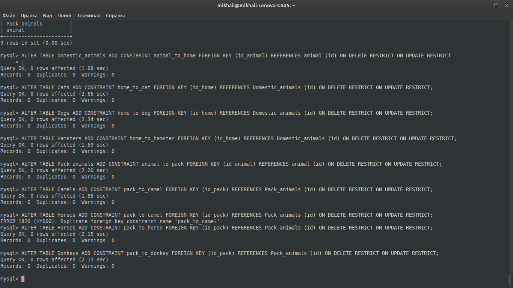

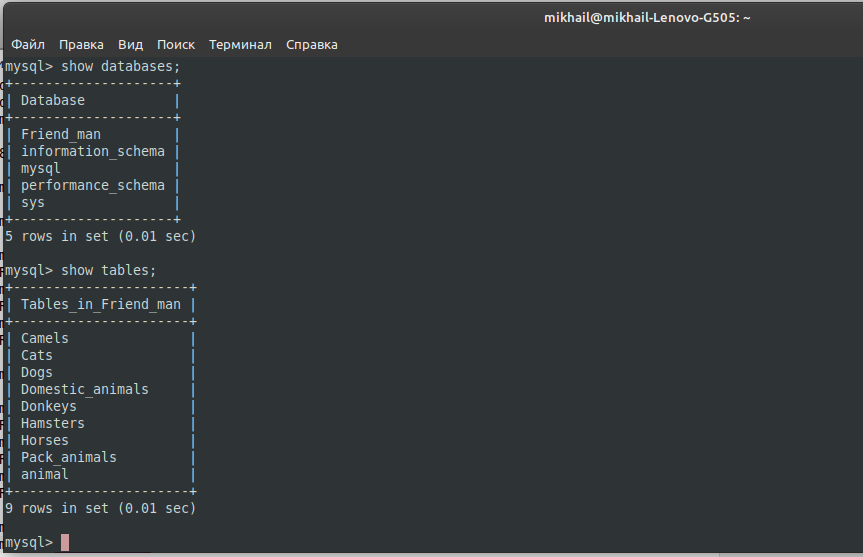

9. Заполнить низкоуровневые таблицы именами(животных), командами
которые они выполняют и датами рождения

ALTER TABLE Domestic_animals ADD CONSTRAINT animal_to_home FOREIGN KEY (id_animal) REFERENCES animal (id) ON DELETE RESTRICT ON UPDATE RESTRICT
;

ALTER TABLE Cats ADD CONSTRAINT home_to_cat FOREIGN KEY (id_home) REFERENCES Domestic_animals (id) ON DELETE RESTRICT ON UPDATE RESTRICT;

ALTER TABLE Dogs ADD CONSTRAINT home_to_dog FOREIGN KEY (id_home) REFERENCES Domestic_animals (id) ON DELETE RESTRICT ON UPDATE RESTRICT;

ALTER TABLE Hamsters ADD CONSTRAINT home_to_hamster FOREIGN KEY (id_home) REFERENCES Domestic_animals (id) ON DELETE RESTRICT ON UPDATE RESTRICT;

ALTER TABLE Pack_animals ADD CONSTRAINT animal_to_pack FOREIGN KEY (id_animal) REFERENCES animal (id) ON DELETE RESTRICT ON UPDATE RESTRICT;

ALTER TABLE Camels ADD CONSTRAINT pack_to_camel FOREIGN KEY (id_pack) REFERENCES Pack_animals (id) ON DELETE RESTRICT ON UPDATE RESTRICT;

ALTER TABLE Horses ADD CONSTRAINT pack_to_horse FOREIGN KEY (id_pack) REFERENCES Pack_animals (id) ON DELETE RESTRICT ON UPDATE RESTRICT;

ALTER TABLE Donkeys ADD CONSTRAINT pack_to_donkey FOREIGN KEY (id_pack) REFERENCES Pack_animals (id) ON DELETE RESTRICT ON UPDATE RESTRICT;

INSERT INTO Pack_animals (class, id_animal) VALUES ('Pack', 1);

INSERT INTO Camels (name, decree, birthdate, id_pack) VALUES ('Hunchback', 'forward', '2021-10-01', 1), ('Saxaul', 'lie down', '2020-11-12', 1), ('Grenadier', 'stand', '2021-04-05', 1);

INSERT INTO Donkeys (name, decree, birthdate, id_pack) VALUES ('Stubborn', 'forward', '2019-08-11', 1), ('Big - eared', 'lie down', '2022-01-13', 1), ('Baby', 'stand', '2019-02-12', 1);

INSERT INTO Horses (name, decree, birthdate, id_pack) VALUES ('The light', 'forward', '2019-09-01', 1), ('Red', 'lie down', '2018-12-19', 1), ('Frisky', 'stand', '2022-06-05', 1);

INSERT INTO Domestic_animals (class, id_animal) VALUES ('Domestic', 1);

INSERT INTO Cats (name, decree, birthdate, id_home) VALUES ('fluffy', 'forward', '2022-05-01', 1), ('murzik', 'lie down', '2023-11-30', 1), ('stepashka', 'stand', '2020-04-05', 1);

INSERT INTO Dogs (name, decree, birthdate, id_home) VALUES ('balls', 'forward', '2023-10-01', 1), ('call', 'lie down', '2020-11-12', 1), ('bobik', 'stand', '2019-02-12', 1);

INSERT INTO Hamsters (name, decree, birthdate, id_home) VALUES ('kolobok', 'forward', '2019-09-01', 1), ('balls', 'lie down', '2021-10-25', 1), ('hamster', 'stand', '2022-11-25', 1);

10. Удалив из таблицы верблюдов, т.к. верблюдов решили перевезти в другой
питомник на зимовку. Объединить таблицы лошади, и ослы в одну таблицу.

DELETE FROM Camels;
SELECT name, decree, birthdate, id_pack FROM Horses UNION SELECT name, decree, birthdate, id_pack FROM Horses;

11. .Создать новую таблицу “молодые животные” в которую попадут все
животные старше 1 года, но младше 3 лет и в отдельном столбце с точностью
до месяца подсчитать возраст животных в новой таблице

CREATE TABLE Young (id INT NOT NULL, name VARCHAR(50), birthdate DATE,  decree VARCHAR(200), age VARCHAR(50));

INSERT INTO Young (id, name, decree, birthdate, age) SELECT id, cat_name, decree, birthdate, CONCAT(CAST(TIMESTAMPDIFF(YEAR, birthdate, NOW()) AS CHAR), "yar", CAST(MOD(TIMESTAMPDIFF(MONTH, birthdate, NOW()), 12) AS CHAR), "month") AS age FROM Cats WHERE TIMESTAMPDIFF(MONTH, birthdate, NOW()) BETWEEN 12 AND 36;

INSERT INTO Young (id, name, decree, birthdate, age) SELECT id, dog_name, decree, birthdate, CONCAT(CAST(TIMESTAMPDIFF(YEAR, birthdate, NOW()) AS CHAR), "yar", CAST(MOD(TIMESTAMPDIFF(MONTH, birthdate, NOW()), 12) AS CHAR), "month") AS age FROM Dogs WHERE TIMESTAMPDIFF(MONTH, birthdate, NOW()) BETWEEN 12 AND 36;

INSERT INTO Young (id, name, decree, birthdate, age) SELECT id, hamster_name, decree, birthdate, CONCAT(CAST(TIMESTAMPDIFF(YEAR, birthdate, NOW()) AS CHAR), "yar", CAST(MOD(TIMESTAMPDIFF(MONTH, birthdate, NOW()), 12) AS CHAR), "month") AS age FROM Hamsters WHERE TIMESTAMPDIFF(MONTH, birthdate, NOW()) BETWEEN 12 AND 36;

INSERT INTO Young (id, name, decree, birthdate, age) SELECT id, horse_name, decree, birthdate, CONCAT(CAST(TIMESTAMPDIFF(YEAR, birthdate, NOW()) AS CHAR), "yar", CAST(MOD(TIMESTAMPDIFF(MONTH, birthdate, NOW()), 12) AS CHAR), "month") AS age FROM Horses WHERE TIMESTAMPDIFF(MONTH, birthdate, NOW()) BETWEEN 12 AND 36;

INSERT INTO Young (id, name, decree, birthdate, age) SELECT id, donkey_name, decree, birthdate, CONCAT(CAST(TIMESTAMPDIFF(YEAR, birthdate, NOW()) AS CHAR), "yar", CAST(MOD(TIMESTAMPDIFF(MONTH, birthdate, NOW()), 12) AS CHAR), "month") AS age FROM Donkeys WHERE TIMESTAMPDIFF(MONTH, birthdate, NOW()) BETWEEN 12 AND 36;

12. Объединить все таблицы в одну, при этом сохраняя поля, указывающие на
прошлую принадлежность к старым таблицам.

CREATE TABLE Full_construction AS;
SELECT Dogs AS id, name, decree, birthdate FROM Dogs
UNION ALL
SELECT Cats AS id, name, decree, birthdate FROM Cats
UNION ALL
SELECT Hamsters  AS id, name, decree, birthdate FROM Hamsters 
UNION ALL
SELECT Horses AS id, name, decree, birthdate FROM Horses
UNION ALL
SELECT Donkeys AS id, name, decree, birthdate FROM Donkeys;
